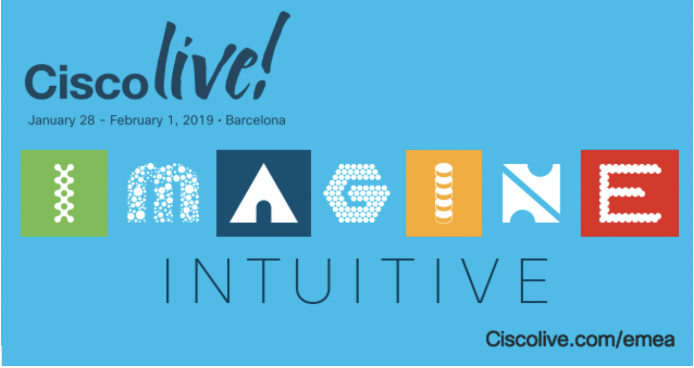
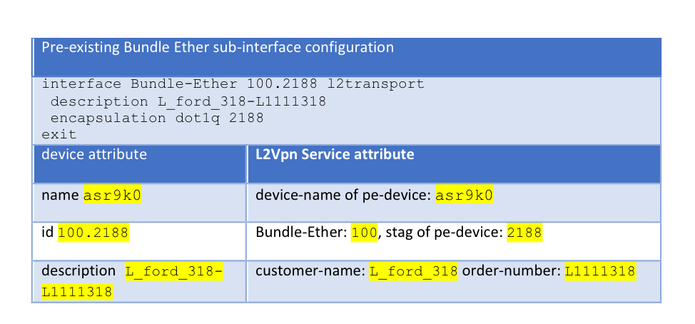

LABNMS-2500
===========

Task 2: Service discovery and reconciliation A: Create L2Vpn service instances from pre-existing configuration. 
--------------------------------------------------------------------------------------------------------

One of the typical brownfield service orchestration requirements is to
have NSO discover and reconcile the pre-existing services in the
network. The pre-existing service configurations can be brought into
NSO’s device model through NSO CLI operation “sync-from”. By default,
NSO assumes that devices own the pre-existing configuration. This is to
ensure that the out-of-band configurations are not accidentally
overwritten by NSO’s service operations.

However, in many cases, we need to have NSO fully manage the lifecycle
of the pre-existing services. This is called NSO service discovery and
reconciliation.

NSO service discovery and reconciliation for brownfield starts with
creating service instances (the service instances that match the
out-of-band service configurations. After the service instances are
created, we need to transfer the ownership of the configuration to NSO.

In this lab, the PE devices (asr9k0, asr9k1 and asr9k2) all have
pre-existing L2VPN services that are configured out-of-band. They are synced to NSO’s device model via NSO’s
`sync-from` operation.


In this task, you will create L2Vpn service instances to match the
pre-existing configurations. You will also observe service lifecycle
management issues without transferring the ownership of the pre-existing
configuration.

### Check device model for pre-existing L2VPN configurations

As mentioned, the pre-existing L2VPN configurations are brought in to
NSO’s device model through `sync-from` operation.

1.  Perform a sync-from to bring the
    pre-existing configurations to NSO’s device model

	```
	[nso@cl-lab-211 ~]$ ncs_cli -u admin

	admin connected from 128.107.235.22 using ssh on cl-lab-211
	admin@ncs> conf
	admin@ncs% request devices sync-from
	sync-result {
    	device asr9k0
    	result true
	}
	sync-result {
    	device asr9k1
    	result true
	}
	sync-result {
    	device asr9k2
    	result true
	}
	[ok][2017-04-29 09:20:11]

	[edit]

	```
  
1.  Check NSO’s device model to view pre-existing Bundel-Ether
    sub-interfaces

	```
	[nso@cl-lab-211 ~]$ ncs_cli -u admin

	admin connected from 128.107.235.22 using ssh on cl-lab-211
	admin@ncs> conf
	admin@ncs% show devices device asr9k0 config cisco-ios-xr:interface Bundle-Ether-subinterface
	Bundle-Ether 100.2188 {
    	mode        l2transport;
    	description L_ford_318-L1111318;
    	encapsulation {
        dot1q {
            vlan-id [ 2188 ];
        }
    	}
	}
	Bundle-Ether 100.2234 {
    	mode        l2transport;
    	description L_unitedhealth_318-L1111318;
    	encapsulation {
        dot1q {
            vlan-id [ 2234 ];
        }
    	}
	}
	Bundle-Ether 100.2291 {
    	mode        l2transport;
    	description L_mckesson_318-L1111318;
    	encapsulation {
        dot1q {
            vlan-id [ 2291 ];
        }
    	}
	}
	………
	………

	```
  
### Create L2Vpn service instances for pre-existing configuration

As part of L2Vpn servivce discovery, 
one L2Vpn service instance should be created to match each pre-existing
Bundle-Ether sub-interface. In this step, you will manually create two
L2Vpn service instances to match two pre-existing Bundle-Ether
sub-interfaces, through NSO cli.

Compare to what we have done at *Task 1:*,
service instance creation is reverse mapping device model to service model. The following is the device attribute to service attribute mapping
example table:




1.  Create two service instances, name them as
    test1 and test2 to match two pre-existing configurations 
    **Note: Since you are creating L2Vpn service instances to match the
    pre-existing configurations, make sure the service attributes
    match exactly to what appear in device configuration.
    **

	 ```
	 [nso@cl-lab-211 ncs-run]$ ncs_cli -u admin

	admin connected from 128.107.235.22 using ssh on cl-lab-211
	admin@ncs> conf
	Entering configuration mode private
	Current configuration users:
	admin ssh (cli from 128.107.235.22) on since 	2017-04-29 09:17:58 private mode
	[ok][2017-04-29 09:35:29]

	[edit]
	admin@ncs% set services L2Vpn test1 order-number 	L1111318 customer-name L_ford_318 pe-devices asr9k0 Bundle-Ether 100 stag 2188
	[ok][2017-04-29 09:36:33]

	[edit]
	admin@ncs% set services L2Vpn test2 order-number L1111318 customer-name L_unitedhealth_318 pe-devices asr9k0 Bundle-Ether 100 stag 2234
	[ok][2017-04-29 09:39:25]

	[edit]

	 ```
  
1. Confirm “commit dry-run” output is empty.
	

   **Make sure you are still in ncs cli’s config mode**, **if “commit
    dry-run” output is not empty, do not continue. Check the attribute
    values at the previous step.**

	```
	admin@ncs% commit dry-run outformat native                                                            
	native {
	}
	[ok][2017-04-29 09:39:30]

	```
1.  After confirm the output of `commit dry-run outformat native` does
    not contain any CLI, continue commit the service instances, and then
    exit from ncs cli. We will commit with option `no-networking`, this
    option makes sure the instances are committed to cdb without
    changing the configuration of network devices.

    **Make sure you are still in ncs cli’s config mode**. With option
    `no-networking`, NSO is committing the changes only to cdb.

	```
	admin@ncs% commit no-networking
	Commit complete.
	[ok][2017-04-29 09:42:50]

	[edit]
	admin@ncs% exit
	[ok][2017-06-02 07:58:37]
	admin@ncs> exit
	[nso@cl-lab-211 packages]$

	 ```
  
### Observe the issues 

As mentioned, although the service instances (`test1` and `test2`) matching the
two pre-existing Bundle-Ether sub-interfaces are committed in NSO, NSO
is not able to modify or delete the associated device configuration.
This is because, by default, devices own the out-of-band configurations.

1. Try to delete instance `test1`.

	```
	[nso@cl-lab-211 packages]$ ncs_cli -u admin

	admin connected from 172.23.123.13 using ssh on cl-lab-211
	admin@ncs> conf
	Entering configuration mode private
	[ok][2017-06-02 07:59:37]

	[edit]

	admin@ncs% show services L2Vpn test1
	order-number  L1111318;
	customer-name L_ford_318;
	pe-devices asr9k0 {
    Bundle-Ether 100;
    stag         2188;
	}
	[ok][2017-04-29 10:04:30]

	[edit]
	admin@ncs% delete services L2Vpn test1
	[ok][2017-04-29 10:04:40]

	[edit]
	admin@ncs% commit dry-run outformat native
	native {
	}
	[ok][2017-04-29 10:04:47]

	[edit]
	admin@ncs% commit
	Commit complete.
	[ok][2017-04-29 10:04:56]

	[edit]

	``` 

1.  After commit the delete operation, confirm service instance `test1` is
    no longer in cdb of NSO.

  	```
  	admin@ncs% show services L2Vpn test1
	-------------------------------^
	syntax error: element does not exist
	[error][2017-05-05 00:44:15]
	[edit]
	admin@ncs%   	
	```

1.  Although the service instance test1is deleted from NSO, the
    associated Bundle Ether sub-interface 100.2188 **remains** in
    asr9k0. The out-of-band configuration can’t be modified through NSO!
    
	```
	admin@ncs% show devices device asr9k0 config cisco-ios-xr:interface Bundle-Ether-subinterface Bundle-Ether 100.2188
	Bundle-Ether 100.2188 {
    	mode        l2transport;
    	description L_ford_318-L1111318;
    	encapsulation {
        	dot1q {
            vlan-id [ 2188 ];
        }
    	}
	}

	```

You have completed Task 2. You created two L2Vpn service instances to
match the pre-existing configurations. You also observed that deleting
or modifying the service instances does not change the out-of-band
device configuration. This implies that NSO is not managing the
lifecycle of service instances of pre-existing configuration.

In next Task, you will learn to complete service reconciliation by
resetting the reference count of pre-existing services.

Service discovery and reconciliation B: Reset reference count
-------------------------------------------------------------

As the first step of service discovery, the L2Vpn service instances are
created in the previous Task. To complete the discovery process, we need
to reconcile the pre-existing L2VPN services.

NSO uses an annotation tag of reference count to keep track of the
configuration ownership. In this task, you will learn how to transfer
the ownership of pre-existing configuration from device’s out-of-band to
NSO by ref-count reset operation. Once the ref-count is reset, NSO can
manage the lifecycle of the pre-existing L2VPN services. You will test
by deleting the service instances and see the associated
Bundle-Ether-sub interfaces are removed from the devices.

In this task, you will work on instance test2 to complete the service
discovery/reconcile through resetting the reference count (ref-count).

### Check the ref-count of L2VPN configuration

1.  Check ref-count of the Bundle Ether sub-interfaces. As you can see,
    Bundle-Ether 100.2234 has backpointers point to the service instance
    test2 (which we created at **Step 10**). The value of ref-count
    is 2. This indicates that NSO service instance test2 is not the sole
    owner of the configuration.

  ---------------------------------------------------------------------------------------------------------------------------
  admin@ncs% show devices device asr9k0 config cisco-ios-xr:interface Bundle-Ether-subinterface | display service-meta-data
  
  Bundle-Ether 100.2188 {
  
  mode l2transport;
  
  description L\_ford\_318-L1111318;
  
  encapsulation {
  
  dot1q {
  
  vlan-id [ 2188 ];
  
  }
  
  }
  
  }
  
  /\* Refcount: 2 \*/
  
  /\* Backpointer: [ /ncs:services/L2Vpn:L2Vpn[L2Vpn:sr-name='test2'] ] \*/
  
  Bundle-Ether 100.2234 {
  
  /\* Refcount: 2 \*/
  
  /\* Originalvalue: l2transport \*/
  
  mode l2transport;
  
  /\* Refcount: 2 \*/
  
  /\* Originalvalue: L\_unitedhealth\_318-L1111318 \*/
  
  description L\_unitedhealth\_318-L1111318;
  
  encapsulation {
  
  dot1q {
  
  vlan-id [ 2234 ];
  
  }
  
  }
  
  }
  
  Bundle-Ether 100.2291 {
  
  mode l2transport;
  
  description L\_mckesson\_318-L1111318;
  
  encapsulation {
  
  dot1q {
  
  vlan-id [ 2291 ];
  
  }
  
  }
  
  }
  ---------------------------------------------------------------------------------------------------------------------------

### Reset the ref-count of L2VPN configuration

At this step, you will transfer the configuration ownership from device
to NSO through ref-count reset.

1.  Reset ref-count of Bundel-Ether 100.2234 through the operation
    “service L2Vpn re-deploy reconcile”. This reset the value of
    ref-count, service instance test2 will then be the sole owner of the
    configurations.

  -------------------------------------------------------------
  admin@ncs% request services L2Vpn test2 re-deploy reconcile
  
  [ok][2017-11-26 11:42:19]
  
  [edit]
  -------------------------------------------------------------

1.  Perform a device sync-from.

  --------------------------------------
  admin@ncs% request devices sync-from
  
  sync-result {
  
  device asr9k0
  
  result true
  
  }
  
  sync-result {
  
  device asr9k1
  
  result true
  
  }
  
  sync-result {
  
  device asr9k2
  
  result true
  
  }
  
  [ok][2017-11-26 11:57:52]
  --------------------------------------

1.  Now let’s check ref-count. Notice the value of ref-count attached
    with Bundle-Ether 100.2234 is 1, backpointer to test2.

  ---------------------------------------------------------------------------------------------------------------------------
  admin@ncs% show devices device asr9k0 config cisco-ios-xr:interface Bundle-Ether-subinterface | display service-meta-data
  
  Bundle-Ether 100.2188 {
  
  mode l2transport;
  
  description L\_ford\_318-L1111318;
  
  encapsulation {
  
  dot1q {
  
  vlan-id [ 2188 ];
  
  }
  
  }
  
  }
  
  /\* Refcount: 1 \*/
  
  /\* Backpointer: [ /ncs:services/L2Vpn:L2Vpn[L2Vpn:sr-name='test2'] ] \*/
  
  Bundle-Ether 100.2234 {
  
  /\* Refcount: 1 \*/
  
  mode l2transport;
  
  /\* Refcount: 1 \*/
  
  description L\_unitedhealth\_318-L1111318;
  
  encapsulation {
  
  dot1q {
  
  vlan-id [ 2234 ];
  
  }
  
  }
  
  }
  
  Bundle-Ether 100.2291 {
  
  mode l2transport;
  
  description L\_mckesson\_318-L1111318;
  
  encapsulation {
  
  dot1q {
  
  vlan-id [ 2291 ];
  
  }
  
  }
  
  }
  
  ………
  
  ……..
  ---------------------------------------------------------------------------------------------------------------------------

### Try to delete the service instance created at Step 10

After re-setting the ref-count, the pre-existing L2VPN is reconciled,
NSO is managing the lifecycle of the reconciled service instance. In
this step, you will see the correct behaviour when we delete test2

1.  Delete test2, notice the output of “commit dry-run outformat native”
    contains the correct “no” statement to remove the Bundle Ether
    sub-interface 100.2234.

  -----------------------------------------------------
  admin@ncs% show services L2Vpn test2
  
  order-number L1111318;
  
  customer-name L\_unitedhealth\_318;
  
  pe-devices asr9k0 {
  
  Bundle-Ether 100;
  
  stag 2234;
  
  }
  
  [ok][2017-04-29 10:04:30]
  
  [edit]
  
  admin@ncs% delete services L2Vpn test2
  
  [ok][2017-04-29 11:34:32]
  
  [edit]
  
  admin@ncs% commit dry-run outformat native
  
  native {
  
  device {
  
  name asr9k0
  
  data no interface Bundle-Ether 100.2234 l2transport
  
  }
  
  }
  
  [ok][2017-04-29 11:34:39]
  
  [edit]
  -----------------------------------------------------

1.  Commit after confirm the dry-run output

  -------------------------------
  admin@ncs% commit
  
  Commit complete.
  
  [ok][2017-04-29 11:34:47]
  
  [edit]
  -------------------------------

1.  Now check device model to see Bundle-Ether 100.2234 no longer exists
    in asr9k0.

  ---------------------------------------------------------------------------------------------------------------------
  admin@ncs% show devices device asr9k0 config cisco-ios-xr:interface Bundle-Ether-subinterface Bundle-Ether 100.2234
  
  -----------------------------------------------------------------------------------------------------------\^
  
  syntax error: element does not exist
  
  [error]$[2017-04-29 11:40:54]
  
  [edit]
  ---------------------------------------------------------------------------------------------------------------------

Congratulations! You have successfully finished all the tasks of this
lab!

From Task 1, you learned how to generate NSO service packages. You
created a service package L2Vpn with service Yang model, and template
xml to generate device configlet.

From Task 2 and Task 3, you learnt how to perform service discovery with
brownfield network. You created L2Vpn instances from pre-existing device
configurations, observed the issues, reset the reference count to fully
manage the lifecycle of L2Vpn service instances.

The next task is to extend the service discovery process from manual to
automatic. It is recommended to go through the task and learn how to
create massive service instances from pre-existing configurations, and
reset ref-count automatically.

(Extra Credit) Create an NSO action to discover pre-existing L2VPN service instances automatically. 
----------------------------------------------------------------------------------------------------

In the previous two tasks, Task 2 and Task3, you learned to discover
pre-existing service configurations manually. As one can see, manually
creating service instances to match all the attributes in pre-existing
configurations is time consuming, tedious, and error prone. This
approach does not scale for networks with fair amount of pre-existing
services. To be able to support brownfield network service lifecycle
management, we need to discover pre-existing services automatically.

There are several ways to auto-discover services. One of them is
creating service instances from device model using NSO’s maapi and magic
API’s, followed by resetting the ref-count for the service instances
programmatically.

In this task, you will learn how to create an NSO action to discover
pre-existing L2VPN services through an NSO action.

-   **Note: This task requires python programming, and knowledge of NSO
    maagic and maapi API’s**.

### Create package skeleton for reconcile action

In NSO, action callbacks are used to implement arbitrary operations in
java or python. These operations can be basically anything, e.g.
downloading a file, performing some test, resetting alarms, etc. We will
create an action package, l2vpnreconcile, to perform L2Vpn service
discovery. Although it can be easily extended, for simplicity, this lab
designs the action to perform service discovery from one PE device.

Similar to what we did at Step 3, you will create the package skeleton
first.

1.  []{#_Ref484277028 .anchor}From NSO VM, create a skeleton package,
    name it l2vpnreconcile

  ----------------------------------------------------------------------------------------------------------
  [nso@cl-lab-211]$ cd ~/packages
  
  [nso@cl-lab-211 packages]$ ncs-make-package --service-skeleton python --action-example l2vpnreconcile
  
  [nso@cl-lab-211 packages]$ cd l2vpnreconcile
  
  [nso@cl-lab-211 l2vpnreconcile]$ ls
  
  package-meta-data.xml python README src templates test
  ----------------------------------------------------------------------------------------------------------

### Update l2vpnreconcile.yang file

Action l2vpnreconcile has one input parameter, the PE that we wish to
reconcile the L2Vpn service from. The action has two output parameters,
success (boolean) and message (string), for discovery result, and a
message associated with. You will modify the auto-generated yang file to
capture the input and output parameters.

1.  Edit the auto-generated service yang file, l2vpnreconcile.yang.

> **Option 1: Edit
> ~/packages/l2vpnreconcile/src/yang/l2vpnreconcile.yang from NSO
> server, using “vi” for example;**
>
> **Option 2: Copy the file
> ~/packages/l2vpnreconcile/src/yang/l2vpnreconcile.yang from NSO
> server to window’s jump server using
> (**{width="0.3988221784776903in"
> height="0.5184689413823272in"}**). Edit the file using editors such as
> Sublime (**
> {width="0.4463057742782152in"
> height="0.34611439195100613in"}**),
> Notepad++(**{width="0.3354702537182852in"
> height="0.34453740157480317in"}**). If you take Option 2, remember
> copy the file back to NSO server.**

1.  Edit l2vpnreconcile.yang . We put the action reconcile-l2vpn under
    container action:

{width="6.268055555555556in"
height="5.48125in"}

1.  Change the generated generic action name “double” to
    “reconcile-l2vpn”, and action point “l2vpnreconcile-action” to
    “reconcile”. In addition, as specified above, replace the default
    input parameter “number” with “device-name” , and the default output
    parameter “result” with “success” and “message”.

    The contents of l2vpnreconcile.yang should look like the following:

  ------------------------------------------------
  module l2vpnreconcile {
  
  namespace "http://example.com/l2vpnreconcile";
  
  prefix l2vpnreconcile;
  
  import ietf-inet-types { prefix inet; }
  
  import tailf-common { prefix tailf; }
  
  import tailf-ncs { prefix ncs; }
  
  description
  
  "L2Vpn Reconcile Action";
  
  revision 2016-01-01 {
  
  description
  
  "Initial revision.";
  
  }
  
  container action {
  
  tailf:action reconcile-l2vpn {
  
  tailf:actionpoint reconcile;
  
  input {
  
  leaf device-name {
  
  type leafref {
  
  path "/ncs:devices/ncs:device/ncs:name" ;
  
  }
  
  }
  
  }
  
  output {
  
  leaf message {
  
  type string;
  
  }
  
  leaf success {
  
  type boolean;
  
  }
  
  }
  
  }
  
  }
  
  }
  ------------------------------------------------

-   **Note: Check
    ~/solution/l2vpnreconcile/src/yang/l2vpnreconcile.yang for
    reference.**

1.  Save l2vpnreconcile.yang. If you edit the file from the windows jump
    start server, make sure you copy the file back to NSO server, to
    /home/nso/packages/l2vpnreconcile/src/yang/

### Clean up generated python script

The package l2vpnreconcile is auto generated as a service skeleton at
**item 50**. Auto-generated python file main.py contains snips of
service call back class, which we don’t need. In addition, we want to
rename the generic default action class DoubleAction to Reconcile.

1.  Edit python file,
    /home/nso/packages/l2vpnreconcile/python/l2vpnreconcile/main.py to
    remove service related python script.

> **Option 1: Edit
> ~/packages/l2vpnreconcile/python/l2vpnreconcile/main.py from NSO
> server, using “vi” for example;**
>
> **Option 2: Copy the file
> ~/packages/l2vpnreconcile/python/l2vpnreconcile/main.py from NSO
> server to window’s jump server using
> (**{width="0.3988221784776903in"
> height="0.5184689413823272in"}**). Edit the file using editors such as
> Sublime (**
> {width="0.4463057742782152in"
> height="0.34611439195100613in"}**),
> Notepad++(**{width="0.3354702537182852in"
> height="0.34453740157480317in"}**). If you take Option 2, remember
> copy the file back to NSO server.**

1.  Delete the highlighted “Service Call Back Example” class (make sure
    the whole class ServiceCallbacks is deleted)

{width="6.268055555555556in"
height="4.91875in"}

  --------------------------------------------------------------------
  \# ------------------------
  
  \# SERVICE CALLBACK EXAMPLE
  
  \# ------------------------
  
  class ServiceCallbacks(Service):
  
  \# The create() callback is invoked inside NCS FASTMAP and
  
  \# must always exist.
  
  @Service.create
  
  def cb\_create(self, tctx, root, service, proplist):
  
  self.log.info('Service create(service=', service.\_path, ')')
  
  ……
  
  ……
  
  \# @Service.post\_modification
  
  \# def cb\_post\_modification(self, tctx, op, kp, root, proplist):
  
  \# self.log.info('Service premod(service=', kp, ')')
  --------------------------------------------------------------------

1.  Remove service registration from Main class, delete the highlighted
    line:

{width="6.268055555555556in"
height="4.454166666666667in"}

  -------------------------------------------------------------------------
  class Main(ncs.application.Application):
  
  def setup(self):
  
  \# The application class sets up logging for us. It is accessible
  
  \# through 'self.log' and is a ncs.log.Log instance.
  
  self.log.info('Main RUNNING')
  
  \# Service callbacks require a registration for a 'service point',
  
  \# as specified in the corresponding data model.
  
  \#
  
  self.register\_service('l2vpnreconcile-servicepoint', ServiceCallbacks)
  -------------------------------------------------------------------------

1.  Rename the auto generated action class name from
    DoubleAction(Action) to Reconcile(Action). Remove the contents of
    cb\_action (We will replace the contents at later steps):

{width="6.268055555555556in"
height="2.3555555555555556in"}

  -------------------------------------------------------
  class Reconcile(Action):
  
  @Action.action
  
  def cb\_action(self, uinfo, name, kp, input, output):
  -------------------------------------------------------

1.  in Main function, change the action registration accordingly, i.e,
    replace DoubleAction with Reconcile.

{width="6.268055555555556in"
height="3.8368055555555554in"}

  -----------------------------------------------------------
  class Main(ncs.application.Application):
  
  def setup(self):
  
  \# When using actions, this is how we register them:
  
  \#
  
  self.register\_action('l2vpnreconcile-action', Reconcile)
  -----------------------------------------------------------

### Implement the action call back function to reconcile pre-exisiting L2VPN service.

In this step, you will add python code to action call back function
cb\_action. Inside cb\_action, you will create L2Vpn service instances
from device model, and reset reference count of the service instances.

Creating service instances from device model is a reverse process as
compare to creating a service package. You now need to map device NED
attributes to service attributes. (Refer **Table 7 NSO Ned (cisco-iosxr)
to L2Vpn attribute mapping example). **

After a sync-from operation, the pre-existing configurations are brought
into NSO’s device model. To create L2Vpn service instances, we need to
open a write transaction of cdb, walk through device model, populate
service instance attributes and commit the service instances to cdb.

The logic flow is illustrated as pseudo code in the following table. We
will take several steps to go through the implementation.

Table 8 Flow of reconcile L2Vpn services

  -------------------------------------------------------------------------------------------------------------------------------
  1.  Start write transaction of cdb
  
  2.  From cdb device model, get all Bundle-Ether-subinterfaces of the pe-device (passed in as input parameter of the action)
  
  3.  For each Bundle-Ether-subinterface:
  
      a.  Get the Bundle-Ether-subinterface id (formate as x.y, where x is Bundle-Ether port y represents the sub-interface id)
  
      b.  Parse the Bundle-Ether-subinterface id to get Bundle-Ether port number (x) and Bundle-Ether sub-interface id (y)
  
      c.  Get description, this will be used for L2Vpn service instance name.
  
      d.  Parse description to get customer name and order number
  
      e.  Get encapsulation dot1q vlan id
  
      f.  Create a L2Vpn service instance with:
  
          i.  sr-name: description
  
          ii. pe-devices: the pe-device
  
          iii. pe-device port number: x
  
          iv. pe-device port stag: y
  
          v.  customer: customer name
  
          vi. order-number: order number
  
  4.  Commit dry-run (expect empty output)
  
  5.  Commit the transaction with no-network (not touching devices)
  
  6.  Reset reference count of the service instances (service re-deploy reconcile)
  
  -------------------------------------------------------------------------------------------------------------------------------

Continue editing file main.py.

1.  Import additional packages (on top of main.py)

  -------------------------------------
  import ncs
  
  from ncs.application import Service
  
  from ncs.dp import Action
  
  import random
  
  import \_ncs
  -------------------------------------

1.  []{#_Ref481346965 .anchor}We will create L2Vpn service instances in
    cdb. Inside cb\_action, open write transaction after initialize
    local variables pe\_device and srs:

  -----------------------------------------------------------
  @Action.action
  
  def cb\_action(self, uinfo, name, kp, input, output):
  
  pe\_device = ''
  
  srs = []
  
  with ncs.maapi.Maapi() as m:
  
  with ncs.maapi.Session(m, uinfo.username, uinfo.context):
  
  with m.start\_write\_trans() as t:
  -----------------------------------------------------------

1.  Within the transaction block, continue walk through device model.
    Use maagic api to get the list of Bundle Ether sub-interfaces of the
    pe-device, via the xpath
    ncs:devices/ncs:device{device-name}/config/cisco-ios-xr:interface/Bundle-Ether-subinterface/Bundle-Ether

-   **Note: Make sure the green highlighted line is entered as one line.
    (no line breaks).**

-   **Note: The yellow highlighted line is invoking a function that is
    defined later. **

> We add check (the if len(bundleEths) == 0: block) to cover the case
> when the device has no Bundle Ether sub-interfaces, in which, there is
> no need to create any service instances, the block will return with
> message of reconciliation finished.

  ----------------------------------------------------------------------------------------------------------------------------------------
  @Action.action
  
  def cb\_action(self, uinfo, name, kp, input, output):
  
  pe\_device = ''
  
  srs = []
  
  with ncs.maapi.Maapi() as m:
  
  with ncs.maapi.Session(m, uinfo.username, uinfo.context):
  
  with m.start\_write\_trans() as t:
  
  try:
  
  root = ncs.maagic.get\_root(t)
  
  pe\_device = self.getDevice(input.device\_name, root);
  
  int\_path = '/ncs:devices/ncs:device{%s}/config/cisco-ios-xr:interface/Bundle-Ether-subinterface/Bundle-Ether' %input["device-name"]
  
  if t.exists(int\_path):
  
  bundleEths = ncs.maagic.get\_node(t,int\_path)
  
  if len(bundleEths) == 0:
  
  output.success = True
  
  output.message = "finish reconcile"
  
  return
  ----------------------------------------------------------------------------------------------------------------------------------------

1.  For each Bundle Ether sub-interface in device config, create one
    L2Vpn service instance. Similar to manual service instance creation
    as in **Task 2: Step 10, item 37,** we use device attributes to
    populate service instance attributes. Use interface description as
    sr-name for L2Vpn service instance, and set attributes order-number
    and customer-name. (Refer **Table 9**)

[]{#_Ref499630490 .anchor}Table 9 NSO Device (cisco-iosxr) to L2Vpn
attribute mapping example for auto service instance creation

  ---------------------------------------------------------------------------------------------------------------------------------------------
  Pre-existing Bundle Ether sub-interface configuration
  ------------------------------------------------------------ --------------------------------------------------------------------------------
  interface Bundle-Ether l2transport
  
  description <*customer name*>–<*order-number*>
  
  encapsulation dot1q <*stag*>
  
  exit

  PE device name

  Input parameter of l2vpnreconcile action

  device attribute

  id *<id.stag>*

  description <*customer name*>–<*order-number*>

  dot1aq vlan-id *<stag>*
  ---------------------------------------------------------------------------------------------------------------------------------------------

-   **Note: Make sure the green highlighted line is entered as one line.
    (no line breaks).**

A couple of checks added to cover cases when the Bundle Ether
sub-interface does not have stag (vlan\_id) populated, or when the
description is not populated properly.

  -------------------------------------------------------------------------------------------------------------------------------------------------------
  for bundleEther in bundleEths:
  
  id , bstag = bundleEther.id.split('.')
  
  description = bundleEther.description
  
  stags = bundleEther.encapsulation.dot1q.vlan\_id
  
  if stags is None or len(stags)==0:
  
  continue
  
  stag = 0
  
  for stag in stags:
  
  if int(stag) == int(bstag):
  
  break
  
  if stag == 0:
  
  self.log.warning('vlan tag not configured, or does not match sub-interface id for Bundle-Ether-subinterface %s, use sub-interface id'%bundleEther.id)
  
  order\_number = ''
  
  customer = ''
  
  if description is None:
  
  order\_number = self.getRs()
  
  customer = 'ciscolive'
  
  sr\_name = 'reconcile-'+ customer + '-'+order\_number
  
  else:
  
  sr\_name = description + '-' + input.device\_name
  
  customer,order\_number = description.split('-')
  
  sr\_path = 'ncs:services/L2Vpn:L2Vpn{%s}' %(sr\_name)
  
  if t.exists(sr\_path):
  
  self.log.info('sr ' + sr\_name + 'exists, skipping')
  
  continue
  
  sr\_node = ncs.maagic.get\_node(t, "/ncs:services/L2Vpn:L2Vpn")
  
  obj = sr\_node.create(sr\_name)
  
  obj.sr\_name = sr\_name
  
  obj.order\_number = order\_number
  
  obj.customer\_name = customer
  -------------------------------------------------------------------------------------------------------------------------------------------------------

1.  Continue to create PE node for the service instance, set attributes
    of Bundle Ether port number (id) and stag.

  -------------------------------------------------
  stag = bundleEther.encapsulation.dot1q.vlan\_id
  
  pe\_path = sr\_path + '/pe-devices'
  
  pes_node = ncs.maagic.get\_node(t,pe\_path)
  
  pe\_obj = pes_node.create(input.device\_name)
  
  pe\_obj.stag = bstag
  
  pe\_obj.Bundle\_Ether = id
  
  srs.append(sr\_name)
  -------------------------------------------------

1.  After all the Bundle-Ether-subinterfaces are processed, we perform
    dry-run action to make sure the output is empty (outside the for
    loop). Commit the service instances only if the dry run result is
    empty. Function isDryRunEmpty is defined later.

  ------------------------------------------------------------------------
  if len(srs) >0:
  
  if not self.isDryRunEmpty(root):
  
  output.success = False
  
  output.message = 'commit dry-run output not empty, stop reconcilation'
  
  return
  
  t.apply(flags=\_ncs.maapi.COMMIT\_NCs_NO\_NETWORKING)
  ------------------------------------------------------------------------

1.  Now we are ready to reset the reference count as we have done at
    Task 3: (**Service discovery and reconciliation B: Reset )** at
    **Step 12** via ncs cli.

    Add the following to reset reference count, and close cb\_action.
    Function redeploySrs is defined later.

  -------------------------------------------------------
  pe\_device.sync\_from()
  
  self.redeploySrs(root,srs)
  
  time.sleep(100)
  
  output.success = True
  
  output.message = "Successfully created the services."
  
  except Exception as e:
  
  self.log.error(str(e))
  
  output.success = False
  
  output.message = str(e)
  
  finally:
  
  self.log.info('Context: %s' % uinfo.context)
  -------------------------------------------------------

### Define the helper functions used in reconcile action.

In this step, we are defining the three functions used in cb\_action .

1.  Define function getDevice in Reconcile class. This is to return the
    device object from cdb, with name from the input parameter
    (device-name)

  ------------------------------------------
  class Reconcile(Action):
  
  def getDevice(self,name, root):
  
  if root.devices is None or name is None:
  
  return None
  
  for device in root.devices.device:
  
  if name == device.name:
  
  return device
  
  return None
  ------------------------------------------

1.  Define function isDryRunEmpty in Reconcile class, this is to make
    sure the service instances we created match to the pre-existing
    configuration.

  -----------------------------------------------------
  class Reconcile(Action):
  
  …………
  
  def isDryRunEmpty(self,root):
  
  input = root.services.commit\_dry\_run.get\_input()
  
  input.outformat = "native"
  
  result = root.services.commit\_dry\_run(input)
  
  for dvc in result.native.device:
  
  if dvc.data is not None:
  
  return False
  
  return True
  -----------------------------------------------------

1.  Define redeploySrs in Reconcile class. It performs the same
    operation via maapi as we have done at Task 3: (**Service discovery
    and reconciliation B: Reset** ) at **Step 12**, perform service
    redeploy with option of reconcile for each L2Vpn service instance:

  -----------------------------------------------
  class Reconcile(Action):
  
  …………
  
  def redeploySrs(self,root, srs):
  
  self.log.info('Executing redeplySrs(...)')
  
  if srs is None or len(srs) == 0:
  
  return
  
  for sr in srs:
  
  action = root.services.L2Vpn[sr].re\_deploy
  
  input = action.get\_input()
  
  reconcile = input.reconcile.create()
  
  output = action(reconcile)
  
  output = action()
  -----------------------------------------------

1.  The complete contents of main.py

  -------------------------------------------------------------------------------------------------------------------------------------------------------
  \# -\*- mode: python; python-indent: 4 -\*-
  
  import ncs
  
  from ncs.application import Service
  
  from ncs.dp import Action
  
  import random
  
  import \_ncs
  
  class Reconcile(Action):
  
  def getDevice(self,name, root):
  
  if root.devices is None or name is None:
  
  return None
  
  for device in root.devices.device:
  
  if name == device.name:
  
  return device
  
  return None
  
  def getRs(self):
  
  return str(random.randint(1, 1500))
  
  def redeploySrs(self,root, srs):
  
  self.log.info('Executing redeplySrs(...)')
  
  if srs is None or len(srs) == 0:
  
  return
  
  for sr in srs:
  
  \# action = root.services.L2Vpn[sr].un\_deploy
  
  \# self.log.info('undeploy %s' %sr)
  
  \# input = action.get\_input()
  
  \# ignore = input.ignore\_refcount.create()
  
  \# output = action(ignore)
  
  action = root.services.L2Vpn[sr].re\_deploy
  
  input = action.get\_input()
  
  reconcile = input.reconcile.create()
  
  self.log.info('perform redploy %s' %sr)
  
  output = action(reconcile)
  
  def isDryRunEmpty(self,root):
  
  input = root.services.commit\_dry\_run.get\_input()
  
  input.outformat = "native"
  
  result = root.services.commit\_dry\_run(input)
  
  for dvc in result.native.device:
  
  if dvc.data is not None:
  
  return False
  
  return True
  
  @Action.action
  
  def cb\_action(self, uinfo, name, kp, input, output):
  
  pe\_device = ''
  
  srs = []
  
  self.log.info('start reconcile')
  
  with ncs.maapi.Maapi() as m:
  
  with ncs.maapi.Session(m, uinfo.username, uinfo.context):
  
  with m.start\_write\_trans() as t:
  
  try:
  
  root = ncs.maagic.get\_root(t)
  
  pe\_device = self.getDevice(input.device\_name, root);
  
  if pe\_device is None:
  
  output.success = False
  
  output.message = 'device ' + input.device\_name + 'not in system'
  
  return
  
  message = pe\_device.sync\_from()
  
  int\_path = '/ncs:devices/ncs:device{%s}/config/cisco-ios-xr:interface/Bundle-Ether-subinterface/Bundle-Ether' %input["device-name"]
  
  if t.exists(int\_path):
  
  bundleEths = ncs.maagic.get\_node(t,int\_path)
  
  if len(bundleEths) == 0:
  
  output.success = True
  
  output.message = "finish reconcile"
  
  return
  
  for bundleEther in bundleEths:
  
  id , bstag = bundleEther.id.split('.')
  
  description = bundleEther.description
  
  stags = bundleEther.encapsulation.dot1q.vlan\_id
  
  if stags is None or len(stags)==0:
  
  continue
  
  stag = 0
  
  for stag in stags:
  
  if int(stag) == int(bstag):
  
  break
  
  if stag == 0:
  
  self.log.warning('vlan tag not configured, or does not match sub-interface id for Bundle-Ether-subinterface %s, use sub-interface id'%bundleEther.id)
  
  order\_number = ''
  
  customer = ''
  
  if description is None:
  
  order\_number = self.getRs()
  
  customer = 'ciscolive'
  
  sr\_name = 'reconcile-'+ customer + '-'+order\_number
  
  else:
  
  sr\_name = description + '-' + input.device\_name
  
  customer,order\_number = description.split('-')
  
  sr\_path = 'ncs:services/L2Vpn:L2Vpn{%s}' %(sr\_name)
  
  if t.exists(sr\_path):
  
  self.log.info('sr ' + sr\_name + 'exists, skipping')
  
  continue
  
  sr\_node = ncs.maagic.get\_node(t, "/ncs:services/L2Vpn:L2Vpn")
  
  obj = sr\_node.create(sr\_name)
  
  obj.order\_number = order\_number
  
  obj.customer\_name = customer
  
  pe\_path = sr\_path + '/pe-devices'
  
  pes_node = ncs.maagic.get\_node(t,pe\_path)
  
  pe\_obj = pes_node.create(input.device\_name)
  
  pe\_obj.stag = bstag
  
  pe\_obj.Bundle\_Ether = id
  
  srs.append(sr\_name)
  
  if len(srs) >0:
  
  if not self.isDryRunEmpty(root):
  
  output.success = False
  
  output.message = 'commit dry-run output not empty, stop reconcilation'
  
  t.apply(flags=\_ncs.maapi.COMMIT\_NCs_NO\_NETWORKING)
  
  message = pe\_device.sync\_from()
  
  self.redeploySrs(root,srs)
  
  output.success = True
  
  output.message = "Successfully created the services."
  
  except Exception as e:
  
  self.log.error(str(e))
  
  output.success = False
  
  output.message = str(e)
  
  finally:
  
  self.log.info('Context: %s' % uinfo.context)
  
  class Main(ncs.application.Application):
  
  def setup(self):
  
  self.log.info('Main RUNNING')
  
  self.register\_action('reconcile', Reconcile)
  
  def teardown(self):
  
  self.log.info('Main FINISHED')
  -------------------------------------------------------------------------------------------------------------------------------------------------------

-   **Note: The complete main.py file is available under
    ~/solution/l2vpnreconcile/python/l2vpnreconcile/ for your
    reference.**

1.  Save main.py. If you edit the file from windows jump start server,
    make sure you copy the file back to NSO server, at location
    /home/nso/packages/l2vpnreconcile/python/l2vpnreconcile/

### Compile and deploy action package l2vpnreconcile

In this step, we will compile the action package and deploy to NSO at
NSO server.

1.  Compile package l2vpnreconcile.

  ----------------------------------------------------------------------------------------------------------------------------
  [nso@cl-lab-211 packages]$ cd ~/packages/l2vpnreconcile/src
  
  [nso@cl-lab-211 src]$ make clean all
  
  rm -rf ../load-dir java/src//
  
  mkdir -p ../load-dir
  
  mkdir -p java/src//
  
  /home/nso/ncs-5.0.1/bin/ncsc \`ls l2vpnreconcile-ann.yang >/dev/null 2>&1 && echo "-a l2vpnreconcile-ann.yang"\` \\
  
  -c -o ../load-dir/l2vpnreconcile.fxs yang/l2vpnreconcile.yang
  
  [nso@cl-lab-211 src]$
  ----------------------------------------------------------------------------------------------------------------------------

1.  Add a symbolic link to l2vpnreconcile at ~/ncs-run/packages/, and
    reload packages from ncs cli.

-   **Note: Make sure there is no compilation errors, nor packages
    reload errors. Final version of files l2vpnreconcile.yang and
    main.py are available at ~/solution/l2vpnreconcile directory for
    your reference.
    (~/solution/l2vpnreconcile/src/yang/l2reconcile.yang, and
    ~/solution/l2vpnreconcile/python/l2vpnreconcile/main.py)**

  -----------------------------------------------------------------------------------------------------------------------
  [nso@cl-lab-211 src]$ cd ~/ncs-run/packages
  
  [nso@cl-lab-211 packages]$ ls -l
  
  total 0
  
  lrwxrwxrwx. 1 nso nso 54 Dec 9 04:46 cisco-iosxr-cli-6.6 ->/home/nso/ncs-5.0.1/packages/neds/cisco-iosxr-cli-6.6/
  
  lrwxrwxrwx. 1 nso nso 25 Dec 9 08:19 L2Vpn ->/home/nso/packages/L2Vpn/
  
  [nso@cl-lab-211 packages]$ ln –s /home/nso/packages/l2vpnreconcile/
  
  total 0
  
  lrwxrwxrwx. 1 nso nso 54 Dec 9 04:46 cisco-iosxr-cli-6.6 ->/home/nso/ncs-5.0.1/packages/neds/cisco-iosxr-cli-6.6/
  
  lrwxrwxrwx. 1 nso nso 25 Dec 9 08:19 L2Vpn ->/home/nso/packages/L2Vpn/
  
  lrwxrwxrwx. 1 nso nso 34 Dec 9 09:14 l2vpnreconcile ->/home/nso/packages/l2vpnreconcile/
  
  [nso@cl-lab-211 packages]$
  
  [nso@cl-lab-211 packages]$ ncs_cli -u admin
  
  admin connected from 128.107.235.22 using ssh on cl-lab-211
  
  admin@ncs>request packages reload
  
  >>>System upgrade is starting.
  
  >>>Sessions in configure mode must exit to operational mode.
  
  >>>No configuration changes can be performed until upgrade has completed.
  
  >>>System upgrade has completed successfully.
  
  reload-result {
  
  package L2Vpn
  
  result true
  
  }
  
  reload-result {
  
  package cisco-iosxr-cli-6.6
  
  result true
  
  }
  
  reload-result {
  
  package l2vpnreconcile
  
  result true
  
  }
  
  [ok][2018-12-09 09:16:12]
  -----------------------------------------------------------------------------------------------------------------------

### Test the action script to discover all pre-existing L2VPN services

In this step, you will run the reconcile-l2vpn action to discover the
pre-existing L2VPN services in devices.

1.  Run action reconcile-l2vpn to discover L2VPN services for asr9k0.

-   Note: It takes about 1 to 2 minutes to finish the whole process.

  -----------------------------------------------------------------
  admin@ncs>request action reconcile-l2vpn device-name asr9k0
  
  message Successfully created the services.
  
  success true
  
  [ok][2017-06-03 11:38:21]
  
  admin@ncs>
  
  System message at 2017-06-03 11:38:21...
  
  Commit performed by admin via tcp using cli.
  -----------------------------------------------------------------

1.  Check the discovered L2Vpn services. note, in service instance
    creation code, we set description as the service instance name:

  -----------------------------------------------------------
  admin@ncs>show services L2Vpn ?
  
  Possible completions:
  
  L\_3m\_318-L1111318-asr9k0 - Unique service name
  
  L\_att\_318-L1111318-asr9k0 - Unique service name
  
  L\_comcast\_318-L1111318-asr9k0 - Unique service name
  
  L\_ford\_318-L1111318-asr9k0 - Unique service name
  
  L\_mckesson\_318-L1111318-asr9k0 - Unique service name
  
  ………
  
  admin@ncs>conf
  
  admin@ncs% show services L2Vpn L\_3m\_318-L1111318-asr9k0
  
  order-number L1111318;
  
  customer-name L\_3m\_318;
  
  pe-devices asr9k0 {
  
  Bundle-Ether 100;
  
  stag 276;
  
  }
  
  [ok][2018-12-09 09:43:31]
  
  [edit]
  -----------------------------------------------------------

1.  Try to delete one of them to confirm that NSO is managing the
    lifecycle of reconciled services correctly.

  -------------------------------------------------------------
  admin@ncs>conf
  
  Entering configuration mode private
  
  [ok][2017-06-05 06:17:35]
  
  [edit]
  
  admin@ncs% delete services L2Vpn L\_3m\_318-L1111318-asr9k0
  
  [ok][2017-06-05 06:17:50]
  
  [edit]
  
  admin@ncs% commit dry-run outformat native
  
  native {
  
  device {
  
  name asr9k0
  
  data no interface Bundle-Ether 100.276 l2transport
  
  }
  
  }
  
  [ok][2017-06-05 06:17:57]
  
  [edit]
  -------------------------------------------------------------

1.  Commit the above delete operation. After that, we can see the device
    configuration of Bundle-Ether 100.276 is deleted:

  --------------------------------------------------------------------------------------------------------------------
  admin@ncs% commit
  
  Commit complete.
  
  [ok][2017-04-30 13:12:49]
  
  [edit]
  
  admin@ncs% show devices device asr9k0 config cisco-ios-xr:interface Bundle-Ether-subinterface Bundle-Ether 100.276
  
  -----------------------------------------------------------------------------------------------------------\^
  
  syntax error: element does not exist
  
  [error]$[2017-04-30 13:13:22]
  
  [edit]
  --------------------------------------------------------------------------------------------------------------------

**Congratulations! You have successfully finished this lab.**
